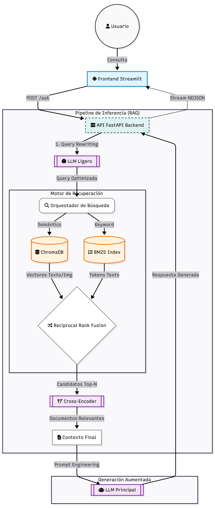

# **Asistente Virtual RAG Multimodal: Especialización en IA y Big Data**

**Sistema de Recuperación Aumentada por Generación (RAG) con capacidades multimodales (Texto \+ Imagen) para la gestión del conocimiento académico.**

## **1\. Descripción del Proyecto**

Este repositorio contiene la implementación completa de un asistente virtual técnico, diseñado para resolver la fragmentación y dispersión de la información habitual en el entorno educativo. Con frecuencia, el material de estudio se encuentra segregado en plataformas educativas, distribuido en múltiples carpetas, PDFs extensos y diapositivas sueltas, lo que obliga al alumno a abrir y buscar manualmente en docenas de archivos para encontrar un concepto específico. Este sistema centraliza y unifica todos estos recursos (apuntes técnicos e imágenes) en una única base de conocimiento, permitiendo a los estudiantes interactuar en lenguaje natural y obtener respuestas precisas sin necesidad de navegar por la compleja estructura de archivos original.

A diferencia de los LLMs generales, este sistema opera bajo un esquema de **Dominio Cerrado**: las respuestas se generan exclusivamente a partir de la documentación indexada, eliminando las alucinaciones y garantizando la trazabilidad de la información mediante citas explícitas a las fuentes.

La solución integra un pipeline avanzado de **Búsqueda Híbrida** (Semántica \+ Palabras Clave) y un sistema de **Reordenamiento (Reranking)**, optimizado específicamente para el idioma español y terminología técnica de Ingeniería de Datos.

### **1.1. Motivación y Problema a Resolver**

En asignaturas técnicas como *Big Data* o *Inteligencia Artificial*, el material de estudio suele estar disperso en múltiples formatos:

* **Texto denso:** Manuales de referencia y papers en PDF.  
* **Información visual crítica:** Diagramas de flujo (ej. arquitectura Kafka), capturas de código y esquemas conceptuales que los LLMs de texto tradicionales ignoran.

**El problema:** Los estudiantes pierden tiempo buscando referencias cruzadas y los modelos estándar fallan al interpretar preguntas que requieren contexto visual específico (ej. "¿Qué representa el bloque azul en el diagrama de arquitectura de Hadoop?").

**Nuestra solución:** Un motor RAG Multimodal que vectoriza tanto el texto como las descripciones semánticas de las imágenes, permitiendo una recuperación de información holística.

### **1.2. Objetivos Principales**

* **Centralización del Conocimiento:** Unificar fuentes en una única base de datos vectorial consultable (ChromaDB).  
* **Precisión Técnica (Zero-Hallucination):** Implementar *Guardrails* estrictos en el prompt del sistema para restringir las respuestas únicamente al contexto recuperado.  
* **Soporte Multimodal Real:** Utilizar modelos de visión (VLM) para generar descripciones ricas de imágenes educativas, permitiendo su recuperación mediante consultas textuales.  
* **Adaptabilidad de Interfaz:** Proveer una experiencia de usuario diferenciada mediante dos arquetipos de asistente:  
  * *Perfil Técnico (ArIA):* Respuestas concisas, código y logs.  
  * *Perfil Docente (LexIA):* Explicaciones pedagógicas y didácticas.  
* **Evaluación:** Medir el rendimiento del sistema mediante métricas objetivas (Hit Rate, MRR, RAGAS) para validar la elección de modelos de embeddings.  
  ---

  ## **2\. Arquitectura Técnica**

El sistema se basa en una arquitectura de servicios desacoplada, donde el frontend (Streamlit) se comunica con el núcleo (FastAPI) mediante peticiones REST. El pipeline RAG implementado sigue un enfoque **híbrido y multimodal**.

### 

### **2.1. Diagrama del Flujo de Datos**

<p align="center">
  
</p>

### **2.2. Componentes del Pipeline**

#### **A. Fase de Ingesta (Offline)**

Antes de la ejecución, los datos no estructurados se procesan y almacenan:

1. **Procesamiento de Texto (PDFs):** Se extrae el contenido textual, se limpia y se fragmenta (*chunking*) en ventanas de contexto optimizadas (1000 tokens con solapamiento).  
2. **Procesamiento de Imágenes:** Se utiliza un **Modelo de Visión-Lenguaje (VLM)** (*LLaVA*) para generar descripciones textuales ricas de cada diagrama o diapositiva.  
3. **Vectorización Dual:**  
   * **Texto:** Se generan embeddings densos utilizando el modelo `Qwen/Qwen3-Embedding-0.6B`.  
   * **Imágenes:** Se generan embeddings visuales utilizando `clip-ViT-B-32`.  
4. **Almacenamiento:** Todo se indexa en **ChromaDB**, manteniendo metadatos críticos (asignatura, página, ruta del archivo).

   #### **B. Fase de Inferencia (Online)**

Cuando el usuario realiza una pregunta:

1. **Reescritura de Consulta (Query Rewriting):** Un LLM ligero reformula la pregunta del usuario utilizando el historial del chat para resolver correferencias (ej. transformar "¿y sus ventajas?" en "¿Cuáles son las ventajas de Kafka?").  
2. **Recuperación Híbrida (Hybrid Search):** Se ejecutan dos búsquedas en paralelo:  
   * *Búsqueda Densa (Vectorial):* Recupera conceptos semánticamente similares.  
   * *Búsqueda Dispersa (BM25):* Recupera coincidencias exactas de palabras clave.  
3. **Fusión de Resultados:** Se combinan ambas listas utilizando el algoritmo **Reciprocal Rank Fusion (RRF)** para obtener los candidatos más robustos.  
4. **Reordenamiento (Reranking):** Un modelo **Cross-Encoder** (`BAAI/bge-reranker-v2-m3`) evalúa la relevancia real de cada par pregunta-documento, descartando falsos positivos.  
5. **Generación de Respuesta:** Se construye un prompt dinámico inyectando el contexto recuperado y se envía al LLM principal (configurado con roles de "ArIA" o "LexIA") para generar la respuesta final en *streaming*.

## 

## 3\. Tecnologías y Modelos

El desarrollo del proyecto se ha realizado utilizando un stack tecnológico moderno, priorizando el rendimiento (baja latencia) y la precisión en la recuperación de información.

### 3.1. Stack Tecnológico (Core)

| Componente | Tecnología | Descripción y Uso |
| :---- | :---- | :---- |
| **Lenguaje Base** | Python 3.10+ | Lenguaje principal por su ecosistema de IA. |
| **Frontend** | Streamlit | Interfaz gráfica rápida para prototipado de aplicaciones de datos. |
| **Backend API** | FastAPI | Framework ASGI de alto rendimiento para exponer los endpoints del modelo. |
| **Vector Database** | ChromaDB | Base de datos vectorial *open-source* y persistente para almacenar embeddings. |
| **Librerías RAG** | SentenceTransformers | Orquestación de modelos de embedding y Cross-Encoders. |
| **Búsqueda Léxica** | Rank\_BM25 | Algoritmo probabilístico para recuperación por palabras clave (Sparse Retrieval). |
| **Procesamiento** | PyMuPDF / Pillow | Extracción de texto de PDFs y manipulación de imágenes. |

### 3.2. Modelos de Inteligencia Artificial

Se han seleccionado modelos específicos tras realizar benchmarks de rendimiento (ver Sección 6), optimizando el balance entre precisión semántica y coste computacional.

| Tipo de Modelo | Modelo Seleccionado | Justificación Técnica |
| :---- | :---- | :---- |
| **Embedding de Texto** | `Qwen/Qwen3-Embedding-0.6B` | Modelo SOTA (State-of-the-Art) multilingüe. Supera a modelos de OpenAI en benchmarks MTEB para español. |
| **Embedding de Imagen** | `clip-ViT-B-32` | Modelo de OpenAI que alinea texto e imagen en el mismo espacio vectorial, crucial para la búsqueda multimodal. |
| **Reranker** | `BAAI/bge-reranker-v2-m3` | Cross-Encoder que reevalúa la relevancia semántica de los candidatos recuperados. Mejora el Hit Rate significativamente. |
| **LLM (Inferencia)** | `llama-3.3-70b-versatile` | Ejecutado vía **Groq** (LPU). Seleccionado por su velocidad de inferencia extrema (\>300 tokens/s) y capacidad de razonamiento. |
| **VLM (Ingesta)** | `llava-phi3` | Modelo de Visión-Lenguaje ejecutado localmente con **Ollama** para generar descripciones densas de las imágenes durante la ingesta. |

### 3.3. Decisiones de Arquitectura

1. **Enfoque "Hybrid Search" (Denso \+ Disperso):**  
     
   * Se utiliza **Búsqueda Vectorial** para captar el significado semántico (ej. entender que "aprendizaje automático" es similar a "machine learning").  
   * Se utiliza **BM25** para captar coincidencias exactas de términos técnicos o acrónimos (ej. "ACID", "CAP", "YARN") que los modelos vectoriales a veces diluyen.  
   * Ambos resultados se normalizan y combinan mediante **Reciprocal Rank Fusion (RRF)**.

   

2. **Estrategia Multimodal "Image-to-Text":**  
     
   * En lugar de realizar una búsqueda pura de imagen-a-imagen, el sistema procesa las imágenes en la fase de ingesta generando descripciones textuales detalladas. Esto permite que una consulta de texto ("diagrama de arquitectura kafka") recupere la imagen correcta basándose en su contenido semántico descrito.

   

3. **Pipeline de Dos Etapas (Retrieval \+ Reranking):**  
     
   * *Etapa 1 (Retrieval):* Recuperación rápida de 50 candidatos combinando ChromaDB y BM25.  
   * *Etapa 2 (Reranking):* Análisis profundo de esos 50 candidatos con el Cross-Encoder para seleccionar los 4 mejores contextualmente. Esto maximiza la precisión sin sacrificar la latencia.

## 4\. Estructura del Proyecto

El proyecto sigue una estructura modular rigurosa, separando claramente la lógica de ingestión de datos (ETL), el backend de inferencia, la interfaz de usuario y los módulos de validación científica.

```ini
RAG_MULTIMODAL/
├── chroma_db_multimodal/      # Base de Datos Vectorial (Persistencia)
├── data/
│   ├── imagenes/              # Dataset Imágenes (.png, .jpg)
│   └── pdfs/                  # Dataset PDFs (Apuntes)
├── img/                       # Logos y avatares UI
├── src/
│   ├── config.py              # Configuración Global
│   ├── api/
│   │   └── api.py             # Backend FastAPI (Lógica RAG)
│   ├── app/
│   │   └── app.py             # Frontend Streamlit (Chat UI)
│   │
│   │   # --- INGESTA (ETL) ---
│   ├── 01_multimodal_ingest.py # Procesar Imágenes + Embeddings
│   ├── 02_ingest_pdfs.py       # Procesar PDFs + Vectorización
│   ├── 03_check_chroma.py      # Diagnóstico de la DB
│   │
│   │   # --- EVALUACIÓN ---
│   ├── 04_resultados.py        # Visualización (t-SNE)
│   ├── 05_comprobar.py         # Test A/B Texto
│   ├── 05_comprobar_img.py     # Test A/B Imágenes
│   ├── 06_buscar_imagen.py     # Debug Búsqueda Visual
│   ├── 07_eval_retrieval.py    # Métricas Hit Rate
│   ├── 08_ragas.py             # Eval Semántica RAGAS
│   └── 09_evaluar_metricas.py  # Benchmark Arquitectura
│
├── .env                        # Claves API
├── requirements.txt            # Dependencias
└── README.md                   # Documentación
```
### **4.1. Descripción de Scripts Clave**

* **`src/api/api.py` (Backend):** Es el orquestador del sistema. Recibe la consulta del usuario, ejecuta la reescritura de la pregunta, lanza la búsqueda híbrida en ChromaDB y BM25, aplica el reranking con Cross-Encoders y gestiona el streaming de la respuesta generada por el LLM.  
* **`src/app/app.py` (Frontend):** Gestiona la experiencia de usuario. Controla la sesión, el historial de chat, la visualización de imágenes recuperadas y la lógica de personalidades (ArIA/LexIA) mediante inyección de CSS dinámico.  
* **`src/01_multimodal_ingest_smart.py`:** Componente crítico de la multimodalidad. Utiliza un modelo de visión local para "ver" y describir textualmente cada imagen del dataset antes de vectorizarla. Esto permite que las imágenes sean recuperables mediante búsquedas semánticas de texto.  
* **`src/02_ingest_pdfs.py`:** Motor de ingesta de documentos. Se encarga de extraer, limpiar y fragmentar (chunking) el contenido de los apuntes en PDF. Posteriormente, vectoriza estos fragmentos y los almacena en ChromaDB, constituyendo el núcleo de conocimiento textual del sistema.

## 5\. Instalación y Uso

Sigue estos pasos para desplegar el entorno de desarrollo local y ejecutar el asistente.

### 5.1. Prerrequisitos

* Anaconda o Miniconda instalado.  
* Python 3.10 o superior.  
* Git.

### 5.2. Configuración del Entorno

1. **Clonar el repositorio:**  
     
   git clone \[https://github.com/tu-usuario/rag-multimodal.git\](https://github.com/tu-usuario/rag-multimodal.git)  
     
   cd rag-multimodal  
     
2. **Crear y activar el entorno virtual:**  
     
   conda create \--name rag\_multimodal python=3.10 \-y  
     
   conda activate rag\_multimodal  
     
3. **Instalar dependencias:**  
     
   pip install \-r requirements.txt  
     
4. **Variables de Entorno (.env):**
   Crea un archivo `.env` en la raíz del proyecto y configura tus claves API. Usa la siguiente plantilla basada en la configuración actual:

```ini
   # --- API KEYS (Requerido) ---
   OPENROUTER_API_KEY="sk-or-..."
   GROQ_API_KEY="gsk_..."

   # --- CONFIGURACIÓN LLM (Cerebro) ---
   # Opciones: 'groq' o 'openrouter'
   LLM_PROVIDER="groq"
   
   # Modelos Específicos
   LLM_MODEL_OPENROUTER="deepseek/deepseek-r1:free"
   LLM_MODEL_GROQ="llama-3.3-70b-versatile"

   # --- RUTAS DE DATOS (PATHS) ---
   DB_PATH="./chroma_db_multimodal(casa_llava_qwen)buena_spanish"
   DATA_PATH_IMAGENES="./data/imagenes"
   DATA_PATH_PDFS="./data/pdfs"

   # --- MODELOS LOCALES (Embeddings & Reranker) ---
   MODEL_EMBEDDING_TEXT="Qwen/Qwen3-Embedding-0.6B"
   MODEL_EMBEDDING_IMAGE="clip-ViT-B-32"
   MODEL_RERANKER="BAAI/bge-reranker-v2-m3"

   # --- PARÁMETROS TÉCNICOS ---
   API_HOST="127.0.0.1"
   API_PORT="8000"
   UMBRAL_RERANKER="0.0"
```

### 5.3. Ejecución del Sistema

El sistema requiere una fase inicial de preparación de datos (Ingesta) antes de poder realizar consultas.

#### Fase 1: Ingesta de Datos (Ejecutar solo al inicio o al actualizar apuntes)

1. **Procesar Imágenes (Multimodal):** Genera descripciones textuales de las imágenes ubicadas en `./data/imagenes` utilizando un VLM local.  
     
   python src/01\_multimodal\_ingest\_smart.py  
     
2. **Procesar Documentos (PDFs):** Limpia, fragmenta y vectoriza los PDFs ubicados en `./data/pdfs`.  
     
   python src/02\_ingest\_pdfs.py

#### Fase 2: Lanzamiento de la Aplicación

Para utilizar el asistente, es necesario ejecutar el Backend y el Frontend en **dos terminales separadas**:

**Terminal 1: Backend (API)** Inicia el servidor lógico que gestiona la IA y la base de datos.

uvicorn src.api.api:app --reload

*Esperar hasta ver el mensaje: `[LISTO] Sistema preparado para consultas.`*

**Terminal 2: Frontend (UI)** Inicia la interfaz gráfica de usuario.

streamlit run src/app/app.py

Una vez iniciados ambos servicios, la aplicación se abrirá automáticamente en tu navegador predeterminado en: [http://localhost:8501](http://localhost:8501).

## 6\. Evaluación y Métricas

Para garantizar la fiabilidad del asistente en un entorno real, se ha sometido el sistema a una batería de pruebas rigurosas, evaluando tanto la capacidad de recuperación (Retrieval) como la calidad de la generación (Generation).

### 6.1. Comparativa de Modelos de Embeddings

Se evaluó el rendimiento de distintos modelos para determinar cuál capturaba mejor la semántica en español del dominio técnico.

| Modelo de Embedding | Rendimiento (Accuracy) | Observaciones |
| :---- | :---: | :---- |
| `intfloat/multilingual-e5-large` | 80.00% | Buen rendimiento general, pero falla en terminología específica. |
| **`Qwen/Qwen3-Embedding-0.6B`** | **90.00%** | **Seleccionado.** Superior en comprensión de instrucciones y contexto técnico en español. |

**Impacto del Idioma en Multimodalidad:** Para la recuperación de imágenes, se analizó cómo afecta el idioma de la descripción generada por el VLM (Vision-Language Model).

| Configuración de Imagen | Rendimiento | Conclusión |
| :---- | :---: | :---- |
| Descripciones en Inglés (Raw) | 85.00% | El modelo de embedding pierde matices al cruzar idiomas. |
| **Descripciones en Español** | **95.00%** | La alineación lingüística entre la consulta del usuario y la descripción de la imagen es crítica. |

### 6.2. Evaluación de Arquitectura (Chunking & Reranking)

Se realizaron pruebas A/B variando el tamaño de fragmentación del texto (Chunk Size) y activando/desactivando el reordenamiento neuronal (Reranker).

**Métricas utilizadas:**

* **Hit Rate@3:** Probabilidad de que el documento correcto esté en el Top 3\.  
* **MRR@3 (Mean Reciprocal Rank):** Calidad del ordenamiento (cuanto más cerca de 1, mejor).  
* **Latencia:** Tiempo promedio de procesamiento por consulta.

| Configuración | Hit Rate@3 | MRR@3 | Latencia (s) | Análisis |
| :---- | :---: | :---: | :---: | :---- |
| `db_800` (Base) | 76.9% | 0.73 | **0.335s** | Muy rápido, pero precisión mejorable. |
| `db_800` (+Reranker) | 84.6% | 0.77 | 5.083s | Mejora notable en recuperación. |
| `db_1000` (Base) | 76.9% | 0.68 | **0.328s** | Similar al base de 800 tokens. |
| **`db_1000` (+Reranker)** | **84.6%** | **0.78** | 5.861s | **Configuración Óptima.** Máxima precisión semántica (MRR), aceptando una mayor latencia. |

**Conclusión Técnica:** La incorporación del **Cross-Encoder (Reranker)** es fundamental. Aunque introduce una latencia de \~5 segundos, eleva la precisión del sistema del 76% al **84.6%**, lo cual es crítico para evitar alucinaciones en respuestas técnicas.

### 

### 6.3. Calidad Semántica (Framework RAGAS)

Para evaluar la respuesta final generada por el LLM, se utilizó el framework RAGAS, que utiliza un "Juez IA" (GPT-4 / Llama-3) para puntuar la calidad.

| Métrica | Puntuación (0-1) | Interpretación |
| :---- | :---: | :---- |
| **Faithfulness** | **0.905** | **Alta.** El sistema apenas alucina; las respuestas se basan casi exclusivamente en el contexto recuperado (apuntes). |
| **Answer Relevancy** | **0.939** | **Excelente.** El asistente responde exactamente a la intención de la pregunta del usuario. |
| **Context Precision** | **0.706** | **Buena.** El sistema recupera mayoritariamente información útil, aunque a veces incluye algo de "ruido" (contexto irrelevante) que el LLM debe filtrar. |

**Validación:** Los resultados demuestran que el sistema es **robusto y confiable** para su uso como tutor académico, priorizando la veracidad de la información (Faithfulness) sobre la creatividad.

## 7\. Funcionalidades del Sistema

El asistente ha sido diseñado no solo como un motor de búsqueda, sino como una herramienta de estudio interactiva con capacidades avanzadas de adaptación al usuario.

### 7.1. Personalización de la Experiencia (Dual Persona)

El sistema implementa dos arquetipos de asistente distintos, seleccionables desde la barra lateral. Esta funcionalidad altera tanto el **Prompt del Sistema (Backend)** como la **Interfaz Gráfica (Frontend)** mediante inyección dinámica de CSS.

| Característica | 👨‍💻 Modo ArIA (Técnico) | 👩‍🏫 Modo LexIA (Docente) |
| :---- | :---- | :---- |
| **Rol** | Ingeniero de Sistemas Senior. | Catedrática Universitaria. |
| **Objetivo** | Eficiencia y precisión técnica. | Pedagogía y comprensión profunda. |
| **Estilo de Respuesta** | Conciso, uso intensivo de *bullet points*, bloques de código y terminología experta. | Explicativo, uso de analogías, tono amable y estructuración didáctica. |
| **Interfaz (UI)** | Tema "Hacker/Terminal" (Fuente Monospace, Acentos Azul Neón). | Tema "Académico/Paper" (Fuente Serif, Acentos Violeta/Lavanda). |
| **Gestión de Errores** | Reportes de error técnicos (Logs). | Mensajes de ayuda y reorientación. |

### 7.2. Recuperación Multimodal (Texto \+ Imagen)

El sistema rompe la barrera del texto plano al integrar recursos visuales en las respuestas:

* **Indexación Semántica de Imágenes:** Las imágenes no se recuperan por nombre de archivo, sino por su contenido visual (interpretado por modelos VLM durante la ingesta).  
* **Renderizado Contextual:** Si la respuesta a una pregunta (ej: "Arquitectura de Spark") se entiende mejor con un diagrama, el sistema recupera la imagen correspondiente y la muestra junto a la explicación textual.  
* **Depuración Visual:** En el frontend, se incluye un expansor "Debug/Kernel" que muestra qué imágenes fueron consideradas candidatas y su puntuación de similitud.

### 7.3. Seguridad y Control de Alucinaciones

Para garantizar la idoneidad académica, se han implementado estrictos *Guardrails* en el prompt del sistema:

1. **Protocolo "Zero-Hallucination":** Si la información no existe en la base de datos vectorial (apuntes), el modelo tiene prohibido inventar una respuesta o utilizar conocimiento externo generalista.  
2. **Filtrado de Dominio:** El asistente rechaza consultas fuera del ámbito académico (ej: recetas de cocina, opiniones deportivas), manteniendo el foco en la materia de estudio.  
3. **Gestión de Rate Limits:** El sistema captura y gestiona proactivamente los errores de cuota de la API (Error 429), informando al usuario con mensajes amigables en lugar de fallos técnicos.

## 

## 8\. Autores y Licencia

Este proyecto ha sido desarrollado como parte del RETO 2 de la Especialización en Inteligencia Artificial y Big Data.

### 👥 Autores

* **Zuriñe Colino** \- *Analista de Datos & IA*
* **Aritz Monje** \- *Analista de Datos & IA*

### 📄 Licencia

Este proyecto está bajo la Licencia **MIT** \- mira el archivo [LICENSE.md](http://LICENSE.md) para más detalles.

---

**Nota:** Este repositorio es de carácter académico y demostrativo. Los documentos PDF e imágenes utilizados en el dataset `data/` son propiedad de sus respectivos autores y se utilizan aquí únicamente con fines educativos bajo el concepto de *Fair Use*.
